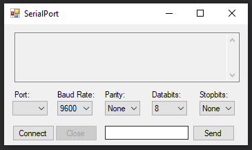
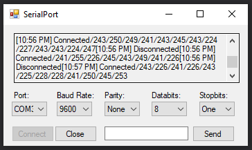

## Serial Port C# application

This is an example app coded in order to understand the library and platform support of serial connections in the .NET enviroment to be used in latter projects.

The app presents the basic parameters for serial connections as well a text field for command inputs:

Given the right parameters and the right communication channel (COM port) the application will register the moment of the opening and closing of a new connection and the received data inbetween:

